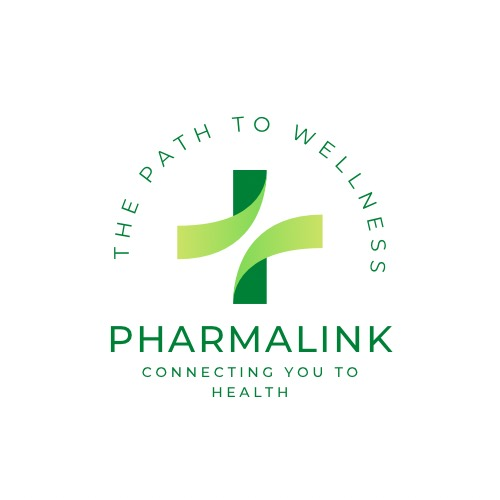

# PharmiLink: Swift Pharmacy Search

Welcome to PharmiLink: Swift Pharmacy Search, a project crafted with a passion for quick and efficient medication search. Our goal is to simplify the process of finding the right medication and locating the nearest pharmacy.

PharmiLink is a revolutionary app that simplifies the process of finding the right medication and the nearest pharmacy. In a world where quick access to healthcare is crucial, PharmiLink comes to the rescue.

## Table of Contents

- [Introduction](#introduction)
- [Demo](#demo)
- [Features](#features)
- [Prerequisites](#prerequisites)
- [Installation](#installation)
- [Usage](#usage)
- [Contributing](#contributing)
- [Screenshots](#screenshots)
- [Team](#team)
- [License](#license)

## Introduction

Of all the things that a potential employer looks at, code is the most important. It is after all, what they are hiring you to do. Also remember, Recruiters and Hiring Managers are busy people. Here is a real-world scenario that may help you understand how important your GitHub is to eventual job placement.

### Why PharmiLink?

PharmiLink aims to unlock health, one link at a time, by simplifying the way people access medications and healthcare services. Our user-friendly app is designed to enhance your well-being and provide you with essential health information whenever you need it.

## Demo

Check out our live demo [here](https://www.loom.com/share/7bef02396ce04789b7c4835dc0e9c354?sid=6a1ce179-720e-4bc6-b7e5-e159caef75d9).

## Features

- **Medication Search:** Quickly find the right medication by entering its name or a related keyword.
- **Pharmacy Locator:** Easily locate the nearest pharmacies with built-in GPS functionality.
- **Medication Availability:** Real-time information on medication availability in nearby pharmacies.
- **Dosage and Usage Info:** Access essential dosage and usage information for every medication.
- **User-Friendly Profiles:** Customize your user profile to receive relevant updates and medication suggestions.

### Prerequisites

- [Dart](https://dart.dev/)
- [Flutter](https://Flutter.dev/)
- [HTML](https://developer.mozilla.org/en-US/docs/Web/HTML)
- [CSS](https://developer.mozilla.org/en-US/docs/Web/CSS)
- [JavaScript](https://developer.mozilla.org/en-US/docs/Web/JavaScript)

## Installation

To get started with PharmiLink, follow these simple installation steps:

1. Clone the repository: `git clone https://github.com/your-username/pharmilink.git`
2. Navigate to the project directory: `cd pharmilink`
3. Run the application: `dart run`
4. Open your browser and go to `http://localhost:3000` to access PharmiLink.
   
## Usage

1. **Search for Medication:** Enter the name or related keyword of the medication you're looking for.
2. **Locate Nearest Pharmacy:** View the list of nearby pharmacies where the medication is available.
3. **Dosage and Usage Info:** Access essential information about dosage and usage for each medication.

## Contributing

We welcome contributions! If you'd like to contribute to PharmiLink, please follow these steps:

1. Fork the repository.
2. Create a new branch.
3. Make your changes and commit them.
4. Push to your branch and submit a pull request.

## Screenshots

## Team

This project was brought to you by a dedicated team of developers:

### mahmoud Youssef
- [GitHub](link-to-your-github)
- [LinkedIn](link-to-your-linkedin)
- [Email](your-email@example.com)

### bechoy ayad
- [GitHub](link-to-your-github)
- [LinkedIn](link-to-your-linkedin)
- [Email](your-email@example.com)

### SALIHA BRIK
- [GitHub](https://github.com/salihabrik)
- [LinkedIn](http://linkedin.com/in/salihabrik)
- [Email](briksaliha@example.com)

## License

This project is licensed under the [MIT License](link-to-your-license-file).

Copyright © 2023 PharmiLink, All rights reserved.